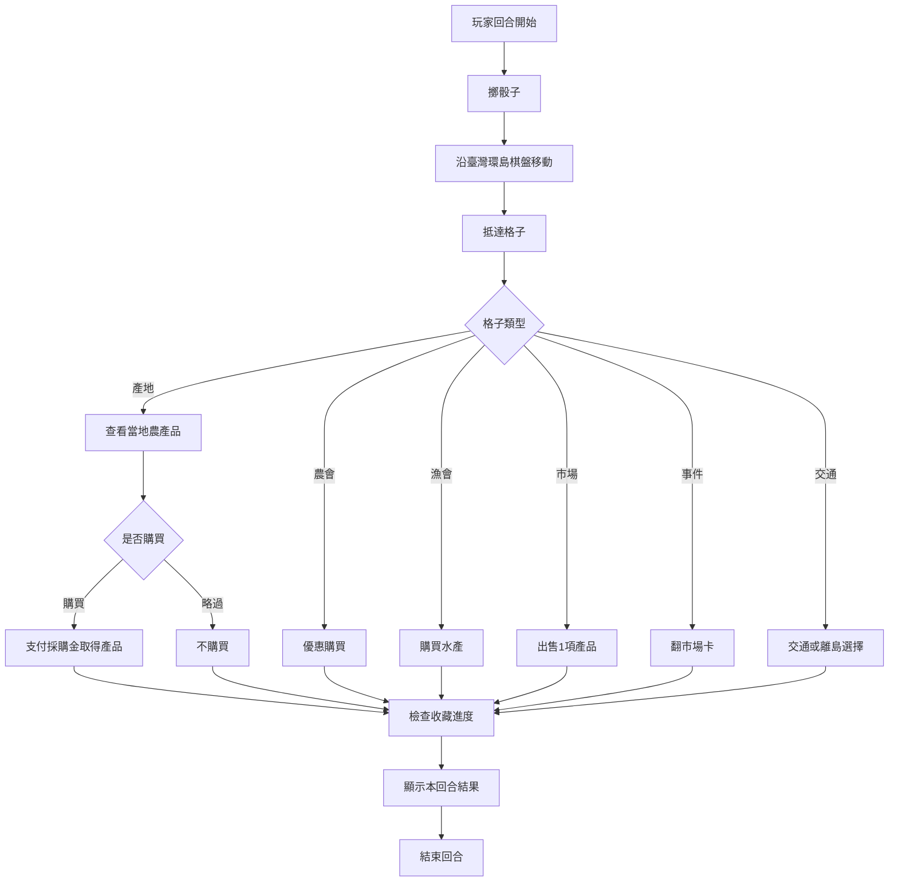

# 《臺灣農產王：環島產地爭霸戰》遊戲規則

## 1. 遊戲目標

玩家扮演「農產採購王」，在臺灣環島棋盤採購各地代表性農漁產品，配合季節與市場行情建立收藏。第12輪結束後，最終總產值最高者獲勝。

本文件定義正式核心規則。Phase 2已以純TypeScript引擎實作；正式臺灣地圖介面尚未完成。

## 2. 基本規格

- 玩家：1至4名真人，未來CPU可補滿4席
- 回合：12輪
- 棋盤：30格
- 主要資源：採購金、農產品、總產值
- 牌庫：20張市場卡、12張收藏任務
- 勝利條件：12輪後總產值最高

## 3. 遊戲準備

1. 每位玩家選擇一個席次與棋子。
2. 所有棋子放在環島起點（position 0）。
3. 每位玩家取得15採購金，且起始沒有產品。
4. 市場卡洗牌後放在公共區。
5. 12項收藏任務全部公開，每位玩家均可各自完成並計分一次。
6. 第一輪從春季開始。

起始採購金以 `STARTING_FUNDS = 15` 集中定義，屬可於未來平衡調整的遊戲數值。

## 4. 季節與旺季

| 輪次   | 季節 |
| ------ | ---- |
| 1至3   | 春   |
| 4至6   | 夏   |
| 7至9   | 秋   |
| 10至12 | 冬   |

產品若在結算時處於資料所列旺季，該項最終持有價值 +1。MVP不設淡季扣分。

## 5. 玩家回合

一個Round是所有玩家各完成一次回合；只有最後一位玩家結束回合後才切換Round與季節。遊戲共12輪。



正式順序如下：

1. 回合開始，確認目前輪次、季節與有效市場狀態。
2. 玩家擲骰並沿棋盤前進。
3. 依抵達格子執行一個主要動作。
4. 若取得產品，立即更新收藏進度。
5. 顯示採購金、產品與回合結果後換下一位玩家。

### 環島完成獎勵

主環島路線為position 0至26。每次正常擲骰移動時，只要本次逐格路徑經過臺北環島起點position 0，即視為完成一圈，並在抵達格子的行動開始前獲得5採購金。玩家不必剛好停在position 0；例如從26擲出1，或從25擲出3（路徑26、0、1）都會獲得獎勵。從position 0開始的移動不會產生開局獎勵。交通格的離島特別行程、傳送與離島採購不會觸發此獎勵；完成多圈可重複獲得。

## 6. 棋盤格

### 產地格

查看該格 `productIds` 所列產品。玩家可支付採購成本購買0或1項。同一玩家同時最多持有每種產品1份；不同玩家可持有相同產品，沒有全域庫存限制。

### 農會直售站

提供農產品0或1項優惠購買，先套用固定-1，再套用符合的市場折扣，最低成本為1。

### 漁會市場

提供水產品購買，產品必須由資料引用，不以縣市名稱硬編碼。

### 農產市場

玩家可出售一項持有產品。出售估值須使用產品基礎產值與當輪市場狀態，不代表真實行情。

### 市場事件

翻開一張市場卡，依卡片資料套用本輪或下一次指定動作的效果。效果不會摧毀全部資產，也不建立永久負面狀態。

### 交通格

主環島路線為position 0至26，26之後回到0；普通擲骰永遠不進入position 27至29。交通格可引用 `transportDestinationIds`，讓玩家選擇澎湖、金門或馬祖的當回合特別行程。離島可依一般產地成本購買0或1項，完成後清除暫時目的地，主棋子仍留在原交通格。

## 7. 市場卡

市場卡分為行情、節慶、天候與通路。支援以下資料效果：

- 單一類別產值調整
- 多類別產值調整
- 指定類別或任意類別採購折扣
- 下一次農會購買折扣

每輪開始抽1張市場卡作為唯一有效卡；Round 1建立遊戲時即抽卡。事件格會將舊卡放入棄牌堆並立即抽新卡取代，效果不疊加。輪末同樣換卡；抽牌堆空時重洗棄牌堆，但當前有效卡不參與重洗。

採購成本依序為產品成本、農會固定-1、符合的 `purchase-discount`，或尚未使用的 `next-association-discount`。後者只適用農會，且每名玩家在該卡有效期間最多使用一次；換卡時重設。所有採購成本最低為1。

## 8. 收藏任務

任務條件支援類別數量、地區數量、不同地區、不同縣市、類別多樣性、農漁混合收藏、特定標籤數量，以及特定標籤的不同產地數。每項任務已通過資料層的理論可達成檢查。完成任務可獲得6至12點加成。

產品 `tags` 是遊戲資料標記，用來表示茶、稻米、沿海、山區等跨類別特徵。臺灣好茶只計算 `tea`，稻米達人只計算 `rice`，海線之旅使用 `coastal`，山城珍味使用 `mountain`；因此同屬「茶與特色作物」的咖啡、金針與洛神葵不會被算作茶。

「農漁雙全」中的水產是 `seafood` 類別；農產明確定義為非水產的五類：`fruit`、`grain`、`vegetable`、`tea-specialty`、`livestock-other`。

## 9. 最終計分

```text
最終總產值 =
手上農產品依最終季節與市場狀態計算的價值
+ 已完成收藏任務加成
+ 剩餘採購金換算
```

剩餘採購金每3點換算1點總產值，小數捨去。例如8採購金換算2點總產值。

產品持有價值以 `baseValue` 為基礎，加入最終有效市場效果與旺季 +1，最低為1。遊戲在Round 12最後一位玩家結束後，以冬季與當時唯一有效的市場卡結算，不抽Round 13市場卡。

## 10. 平手

正式平手順序為：總產值、收藏任務加成、剩餘採購金、持有不同產品數。若仍相同則並列獲勝。

## 11. 數值聲明

> 本遊戲中的「採購金」、「採購成本」與「產值」均為遊戲化數值，僅供玩法與平衡使用，不代表實際市場價格、交易價格或官方農業產值。

## 12. CPU玩家

開始遊戲時可選擇1至4名真人；不足四席由CPU補位。CPU使用與真人相同的擲骰、移動、採購、出售、交通與結束回合規則，只能使用當下公開的產品與市場資訊。CPU會保留一般採購所需資金、保護已完成收藏，並在缺錢或市場溢價時出售；CPU不會查看市場抽牌堆或未來資訊。
