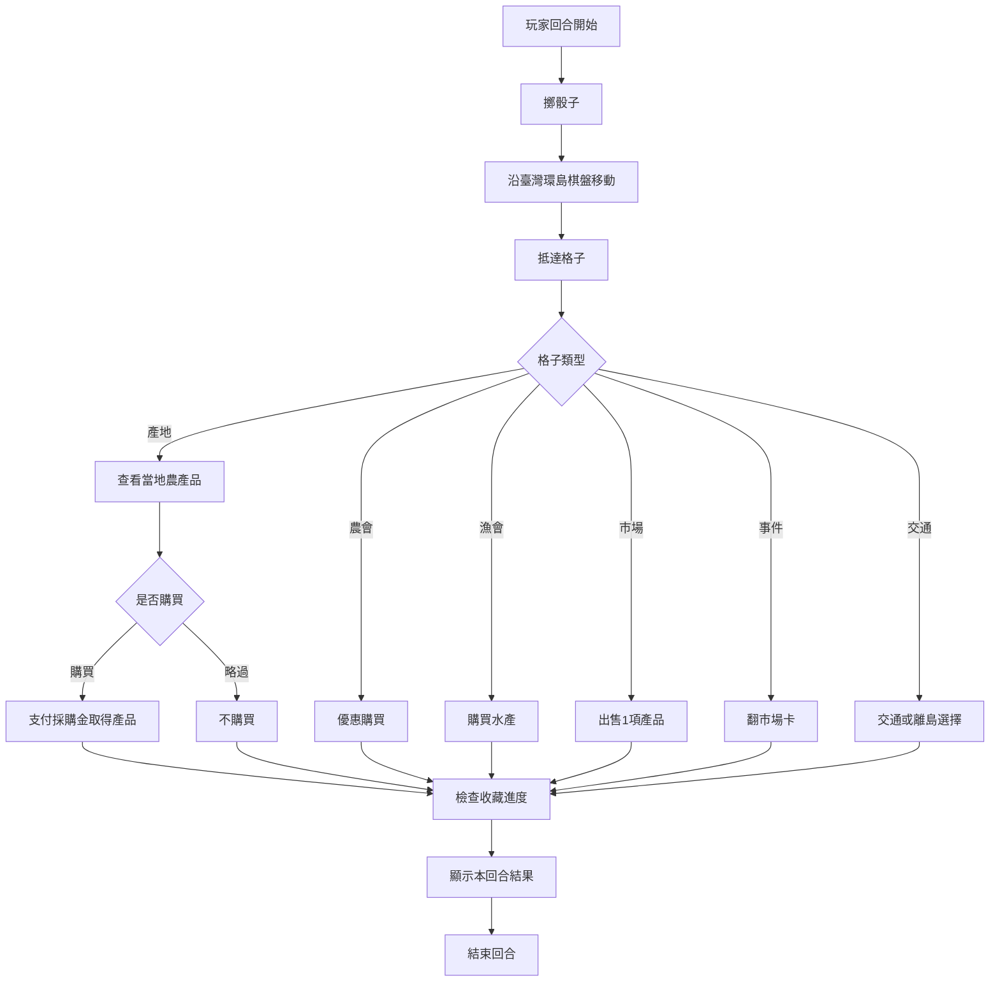

# 《臺灣農產王：環島產地爭霸戰》遊戲規則

## 1. 遊戲目標

玩家扮演「農產採購王」，在臺灣環島棋盤採購各地代表性農漁產品，配合季節與市場行情建立收藏。第12輪結束後，最終總產值最高者獲勝。

本文件定義正式規則方向。Phase 1只建立資料與規則，不實作遊戲引擎。

## 2. 基本規格

- 玩家：1至4名真人，未來CPU可補滿4席
- 回合：12輪
- 棋盤：30格
- 主要資源：採購金、農產品、總產值
- 牌庫：20張市場卡、12張收藏任務
- 勝利條件：12輪後總產值最高

## 3. 遊戲準備

1. 每位玩家選擇一個席次與棋子。
2. 所有棋子放在環島起點。
3. 每位玩家取得正式版本指定的起始採購金。
4. 市場卡洗牌後放在公共區。
5. 收藏任務依未來引擎規格分配或公開。
6. 第一輪從春季開始。

起始採購金與任務分配數量將在 Phase 2 平衡測試後鎖定，不在 Phase 1 假定數值。

## 4. 季節與旺季

| 輪次   | 季節 |
| ------ | ---- |
| 1至3   | 春   |
| 4至6   | 夏   |
| 7至9   | 秋   |
| 10至12 | 冬   |

產品若在結算時處於資料所列旺季，該項最終持有價值 +1。MVP不設淡季扣分。

## 5. 玩家回合



正式順序如下：

1. 回合開始，確認目前輪次、季節與有效市場狀態。
2. 玩家擲骰並沿棋盤前進。
3. 依抵達格子執行一個主要動作。
4. 若取得產品，立即更新收藏進度。
5. 顯示採購金、產品與回合結果後換下一位玩家。

## 6. 棋盤格

### 產地格

查看該格 `productIds` 所列產品。玩家可支付採購成本購買一項，或選擇略過。實際庫存規則在 Phase 2 定義。

### 農會直售站

提供農產品優惠購買。折扣不得使成本低於0；詳細最低成本規則在 Phase 2 鎖定。

### 漁會市場

提供水產品購買，產品必須由資料引用，不以縣市名稱硬編碼。

### 農產市場

玩家可出售一項持有產品。出售估值須使用產品基礎產值與當輪市場狀態，不代表真實行情。

### 市場事件

翻開一張市場卡，依卡片資料套用本輪或下一次指定動作的效果。效果不會摧毀全部資產，也不建立永久負面狀態。

### 交通格

交通格可引用 `transportDestinationIds`。澎湖、金門與馬祖是特殊交通目的地，不是全部直接排列在主環島路線中。Phase 1只定義引用，不實作移動。

## 7. 市場卡

市場卡分為行情、節慶、天候與通路。支援以下資料效果：

- 單一類別產值調整
- 多類別產值調整
- 指定類別或任意類別採購折扣
- 下一次農會購買折扣

同時存在多張效果時的套用順序與持續時間由 Phase 2 引擎測試後定義。任何採購折扣不得造成玩家取得額外採購金。

## 8. 收藏任務

任務條件支援類別數量、地區數量、不同地區、不同縣市、類別多樣性及農漁混合收藏。每項任務已通過資料層的理論可達成檢查。完成任務可獲得6至12點加成。

## 9. 最終計分

```text
最終總產值 =
手上農產品依最終季節與市場狀態計算的價值
+ 已完成收藏任務加成
+ 其他正式任務加成
+ 剩餘採購金換算
```

剩餘採購金每3點換算1點總產值，小數捨去。例如8採購金換算2點總產值。

產品持有價值以 `baseValue` 為基礎，加入最終有效市場效果與旺季 +1。相同效果是否疊加由 Phase 2 明確測試與定義。

## 10. 平手

正式平手順序預定為：收藏任務加成較高者、剩餘採購金較多者、持有產品種類較多者。若仍相同則並列獲勝。此順序須在 Phase 2 測試後確認。

## 11. 數值聲明

> 本遊戲中的「採購金」、「採購成本」與「產值」均為遊戲化數值，僅供玩法與平衡使用，不代表實際市場價格、交易價格或官方農業產值。
